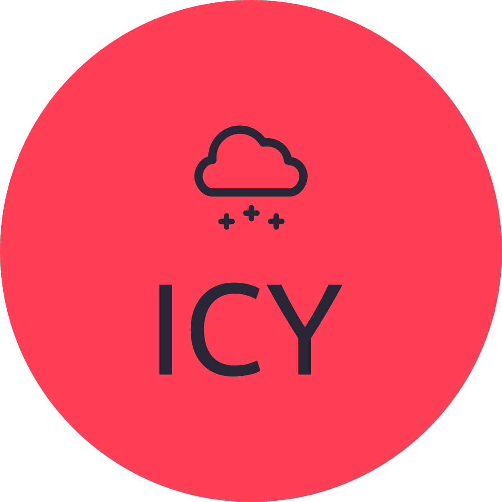

<h1 align="center">Hi 👋, I'm Icy</h1>
<h3 align="center">Frontend Web Developer</h3>
	

 
	

- 👨‍💻 Some of my projects are available at [github](https://github.com/IcyonGit?tab=repositories)

- 📫 How to reach me 
  **Icy@rtyml.com**

	
### 🛠 &nbsp;Languages and Tools

 

 
 ### 🌌  &nbsp;Top Project 
 

### ⚙️ &nbsp;GitHub Analytics

